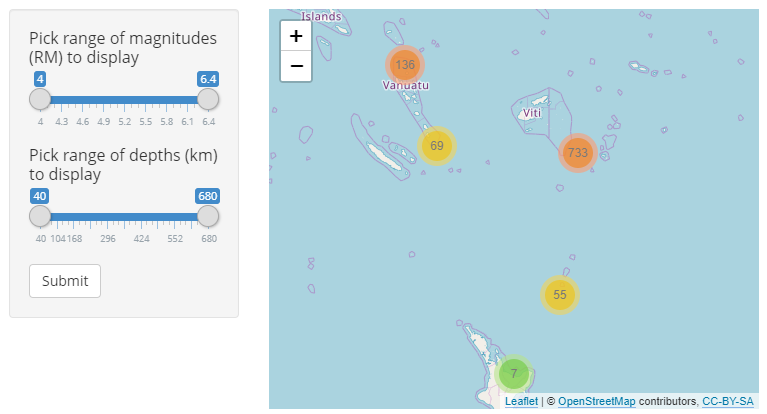

```{r setup, include=FALSE}
knitr::opts_chunk$set(echo = FALSE)
```

## Map of Earthquakes near Fiji

This Shiny app allows the user to visually explore 1,000 earthquakes which 
occured off Fiji since 1964.

The user can filter the earthquakes displayed on the map by two metrics:

* Richter Magnitude  
* Depth (km)

## Screenshot of Interactive Map




## Details

* Areas with multiple earthquakes are shown as clusters with the label showing 
how many earthquakes occured in that area.

* Using the zoom controls ("+" and "-" buttons in the top left corner) or 
clicking on any cluster will zoom the map, splitting clusters into smaller 
clusters or single markers, depending on the zoom level.

* Clicking on a marker shows the following information:
    + Record number in earthquake data set
    + Richter Magnitude
    + Depth in km

## Summary of Earthquakes

The 1,000 earthquakes occurred mostly around a depth of under 100 or approx. 
600 km with magnitudes between 4.1 and 5.0 on the Richter scale.

```{r warning = FALSE, message = FALSE}
library(data.table)
library(ggplot2)

quakes_melted <- melt(as.data.table(quakes[,3:4]), variable.name = "Metrics", 
                      value.name = "Values")
levels(quakes_melted$Metrics) <- c("Depth (km)","Magnitude (RM)")

ggplot(aes(x= Values), data = quakes_melted) +
        geom_histogram(fill = "blue", alpha = 0.6) +
        labs(x = "", y = "Earthquakes") +
        facet_grid(cols = vars(Metrics), scales = "free")
```